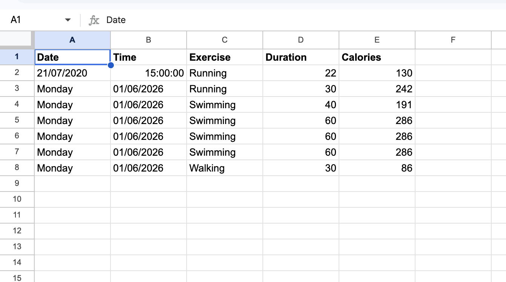

# 🏋️‍♀️ Exercise Tracker

## APIs Used:
* **Nutritionix API:** For natural language processing and calorie calculation.
* **Sheety API:** To turn my Google Sheet into a REST API.

## Demo
Here is what the final Google Sheet looks like:
